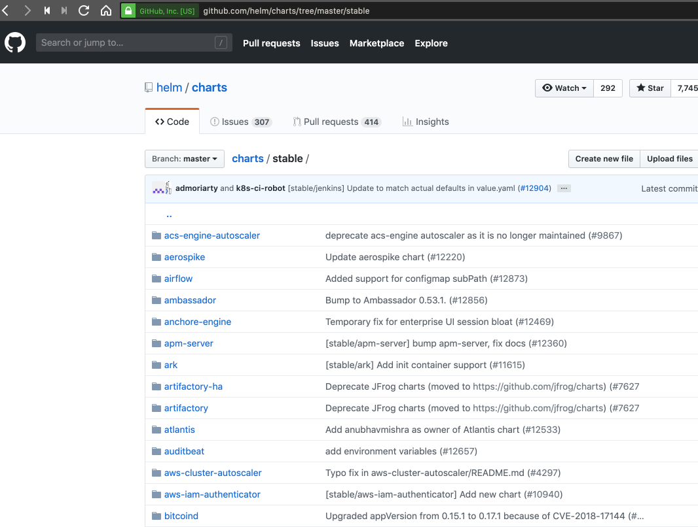

# Helm

```bash
kubernetes-backwards/kubernetes-microservices/k8s on  master [!] at ☸️ fleetman.k8s.local
➜ helm version
Client: &version.Version{SemVer:"v2.13.1", GitCommit:"618447cbf203d147601b4b9bd7f8c37a5d39fbb4", GitTreeState:"clean"}
Error: could not find tiller
```

```bash
kubernetes-backwards/kubernetes-microservices/k8s on  master [!] at ☸️ fleetman.k8s.local
➜ helm init
$HELM_HOME has been configured at /Users/davidainslie/.helm.

Tiller (the Helm server-side component) has been installed into your Kubernetes Cluster.

Please note: by default, Tiller is deployed with an insecure 'allow unauthenticated users' policy.
To prevent this, run `helm init` with the --tiller-tls-verify flag.
For more information on securing your installation see: https://docs.helm.sh/using_helm/#securing-your-helm-installation
Happy Helming!
```

And note the new **tiller** pod:

```bash
kubernetes-backwards/kubernetes-microservices/k8s on  master [!] at ☸️ fleetman.k8s.local
➜ kubectl get pods --namespace kube-system
NAME                                                                  READY     STATUS
...
kube-proxy-ip-172-20-92-230.eu-west-2.compute.internal                1/1       Running
kube-scheduler-ip-172-20-42-159.eu-west-2.compute.internal            1/1       Running
tiller-deploy-7c69c66d57-hzrcg                                        1/1       Running
```

Now check the helm version again:

```bash
kubernetes-backwards/kubernetes-microservices/k8s on  master [!] at ☸️ fleetman.k8s.local took 2s
➜ helm version
Client: &version.Version{SemVer:"v2.13.1", GitCommit:"618447cbf203d147601b4b9bd7f8c37a5d39fbb4", GitTreeState:"clean"}
Server: &version.Version{SemVer:"v2.13.1", GitCommit:"618447cbf203d147601b4b9bd7f8c37a5d39fbb4", GitTreeState:"clean"}
```

Helm has a lot to offer:



## Example - MySql With Helm

```bash
kubernetes-backwards/kubernetes-microservices/k8s on  master [!] at ☸️ fleetman.k8s.local
➜ helm repo update
Hang tight while we grab the latest from your chart repositories...
...Skip local chart repository
...Unable to get an update from the "deis" chart repository (https://charts.deis.com/workflow):
	Get https://charts.deis.com/workflow/index.yaml: dial tcp: lookup charts.deis.com: no such host
...Successfully got an update from the "kubedex" chart repository
...Successfully got an update from the "stable" chart repository
Update Complete. ⎈ Happy Helming!⎈
```

We first need to give the necessary privileges to tiller giving it access to the **default** namespace:

```bash
kubernetes-backwards/kubernetes-microservices/k8s on  master [!?] at ☸️ fleetman.k8s.local
➜ kubectl create serviceaccount --namespace kube-system tiller
serviceaccount "tiller" created

kubernetes-backwards/kubernetes-microservices/k8s on  master [!?] at ☸️ fleetman.k8s.local
➜ kubectl create clusterrolebinding tiller-cluster-rule --clusterrole=cluster-admin --serviceaccount=kube-system:tiller
clusterrolebinding "tiller-cluster-rule" created

kubernetes-backwards/kubernetes-microservices/k8s on  master [!?] at ☸️ fleetman.k8s.local
➜ kubectl patch deploy --namespace kube-system tiller-deploy -p '{"spec":{"template":{"spec":{"serviceAccount":"tiller"}}}}'
deployment "tiller-deploy" patched
```

And now for MySql:

```bash
kubernetes-backwards/kubernetes-microservices/k8s on  master [!?] at ☸️ fleetman.k8s.local
➜ helm install stable/mysql --name my-special-installation --set mysqlPassword=password
NAME:   my-special-installation
LAST DEPLOYED: Mon Apr  8 14:42:44 2019
NAMESPACE: default
STATUS: DEPLOYED

RESOURCES:
==> v1/ConfigMap
NAME                                DATA  AGE
my-special-installation-mysql-test  1     0s

==> v1/PersistentVolumeClaim
NAME                           STATUS   VOLUME  CAPACITY  ACCESS MODES  STORAGECLASS  AGE
my-special-installation-mysql  Pending  gp2     0s

==> v1/Pod(related)
NAME                                          READY  STATUS   RESTARTS  AGE
my-special-installation-mysql-b974d969-dtffg  0/1    Pending  0         0s

==> v1/Secret
NAME                           TYPE    DATA  AGE
my-special-installation-mysql  Opaque  2     0s

==> v1/Service
NAME                           TYPE       CLUSTER-IP     EXTERNAL-IP  PORT(S)   AGE
my-special-installation-mysql  ClusterIP  100.69.89.227  <none>       3306/TCP  0s

==> v1beta1/Deployment
NAME                           READY  UP-TO-DATE  AVAILABLE  AGE
my-special-installation-mysql  0/1    1           0          0s


NOTES:
MySQL can be accessed via port 3306 on the following DNS name from within your cluster:
my-special-installation-mysql.default.svc.cluster.local

To get your root password run:

    MYSQL_ROOT_PASSWORD=$(kubectl get secret --namespace default my-special-installation-mysql -o jsonpath="{.data.mysql-root-password}" | base64 --decode; echo)

To connect to your database:

1. Run an Ubuntu pod that you can use as a client:

    kubectl run -i --tty ubuntu --image=ubuntu:16.04 --restart=Never -- bash -il

2. Install the mysql client:

    $ apt-get update && apt-get install mysql-client -y

3. Connect using the mysql cli, then provide your password:
    $ mysql -h my-special-installation-mysql -p

To connect to your database directly from outside the K8s cluster:
    MYSQL_HOST=127.0.0.1
    MYSQL_PORT=3306

    # Execute the following command to route the connection:
    kubectl port-forward svc/my-special-installation-mysql 3306

    mysql -h ${MYSQL_HOST} -P${MYSQL_PORT} -u root -p${MYSQL_ROOT_PASSWORD}
```

```bash
kubernetes-backwards/kubernetes-microservices/k8s on  master [!?] at ☸️ fleetman.k8s.local took 2s
➜ kubectl get pods
NAME                                           READY     STATUS        RESTARTS   AGE
...
my-special-installation-mysql-b974d969-dtffg   0/1       Pending       0          1m
...
```

```bash
kubernetes-backwards/kubernetes-microservices/k8s on  master [!?] at ☸️ fleetman.k8s.local
➜ kubectl get services
NAME                            TYPE           CLUSTER-IP       EXTERNAL-IP        PORT(S)              ...
my-special-installation-mysql   ClusterIP      100.69.89.227    <none>             3306/TCP
```

```bash
kubernetes-backwards/kubernetes-microservices/k8s on  master [!?] at ☸️ fleetman.k8s.local
➜ helm ls
NAME                   	REVISION	UPDATED                 	STATUS  	CHART       	APP VERSION	NAMESPACE
my-special-installation	1       	Mon Apr  8 14:42:44 2019	DEPLOYED	mysql-0.15.0	5.7.14     	default
```

```bash
kubernetes-backwards/kubernetes-microservices/k8s on  master [!?] at ☸️ fleetman.k8s.local
➜ helm delete --purge my-special-installation
release "my-special-installation" deleted
```

