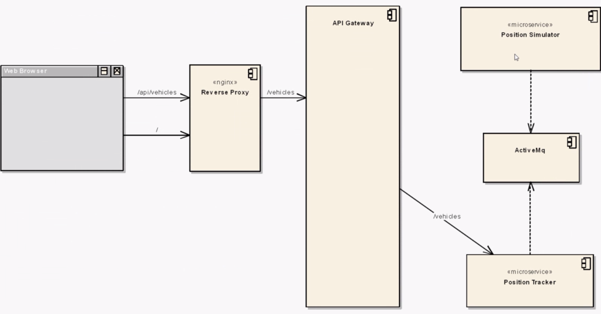
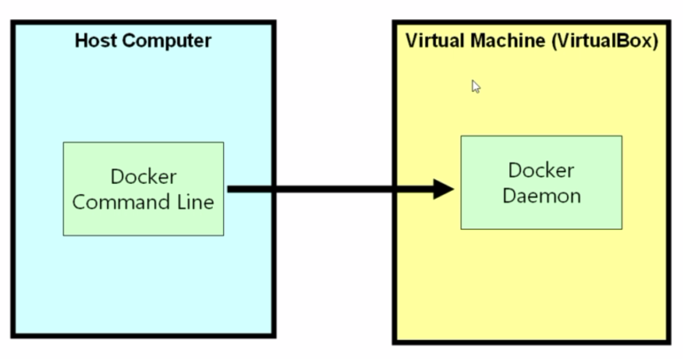
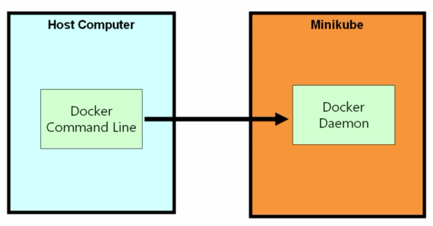
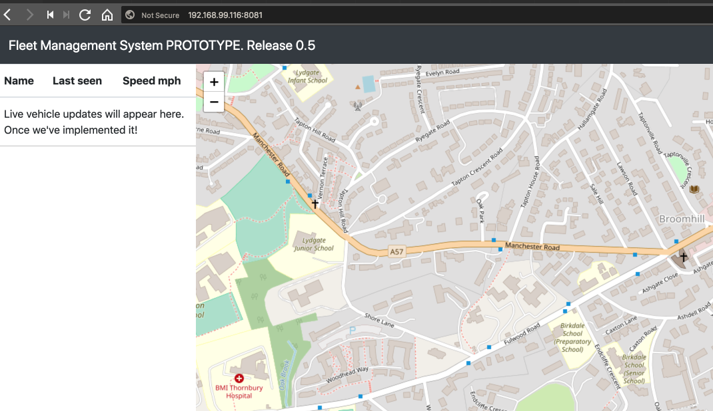

# Introduction

We'll be building and deploying:

> 

Working locally:

```bash
$ minikube start
😄  minikube v0.34.1 on darwin (amd64)
👍  minikube will upgrade the local cluster from Kubernetes 1.13.2 to 1.13.3
💡  Tip: Use 'minikube start -p <name>' to create a new cluster, or 'minikube delete' to delete this one.
🔄  Restarting existing virtualbox VM for "minikube" ...
⌛  Waiting for SSH access ...
📶  "minikube" IP address is 192.168.99.116
🐳  Configuring Docker as the container runtime ...
✨  Preparing Kubernetes environment ...
💾  Downloading kubeadm v1.13.3
💾  Downloading kubelet v1.13.3
🚜  Pulling images required by Kubernetes v1.13.3 ...
🔄  Relaunching Kubernetes v1.13.3 using kubeadm ...
⌛  Waiting for kube-proxy to come back up ...
🤔  Verifying component health ......
💗  kubectl is now configured to use "minikube"
🏄  Done! Thank you for using minikube!
```

```bash
$ kubectl version

Client Version: version.Info{Major:"1", Minor:"9", GitVersion:"v1.9.7", GitCommit:"dd5e1a2978fd0b97d9b78e1564398aeea7e7fe92", GitTreeState:"clean", BuildDate:"2018-04-19T00:05:56Z", GoVersion:"go1.9.3", Compiler:"gc", Platform:"darwin/amd64"}

Server Version: version.Info{Major:"1", Minor:"13", GitVersion:"v1.13.3", GitCommit:"721bfa751924da8d1680787490c54b9179b1fed0", GitTreeState:"clean", BuildDate:"2019-02-01T20:00:57Z", GoVersion:"go1.11.5", Compiler:"gc", Platform:"linux/amd64"}
```

Now of course we'll be using Docker:

> 

and locally we'll be using Minikube:

> 

We can configure Docker CLI to use the Docker Daemon shipped with Minikube.

Firstly, Docker client talking to local Docker server (results vary):

```bash
$ docker image ls
REPOSITORY          TAG                 IMAGE ID            CREATED             SIZE
```

not a lot there (though you may see some images).

Docker client talking to Docker server inside Minikube:

```bash
$ minikube docker-env
export DOCKER_TLS_VERIFY="1"
export DOCKER_HOST="tcp://192.168.99.116:2376"
export DOCKER_CERT_PATH="/Users/davidainslie/.minikube/certs"
export DOCKER_API_VERSION="1.35"
# Run this command to configure your shell:
# eval $(minikube docker-env)

$ eval $(minikube docker-env)

$ echo $DOCKER_HOST
tcp://192.168.99.116:2376
```

All looks good, do we see any different/more images?

```bash
$ docker image ls

REPOSITORY                          TAG          IMAGE ID          CREATED             SIZE
postgres                            latest       f97a959a7d9c      8 days ago          312MB
redis                               latest       0f55cf3661e9      2 weeks ago         95MB
davidainslie/multi-worker           latest       132be0838b60      2 weeks ago         82.5MB
davidainslie/multi-server           latest       f8969686971a      2 weeks ago         87MB
davidainslie/multi-client           latest       c01706eae755      2 weeks ago         110MB
k8s.gcr.io/kube-apiserver           v1.13.3      fe242e556a99      3 weeks ago         181MB
k8s.gcr.io/kube-proxy               v1.13.3      98db19758ad4      3 weeks ago         80.3MB
k8s.gcr.io/kube-controller-manager  v1.13.3      0482f6400933      3 weeks ago         146MB
...
```

Let's pull one of the docker images from the course:

```bash
$ docker image pull richardchesterwood/k8s-fleetman-webapp-angular:release0-5
release0-5: Pulling from richardchesterwood/k8s-fleetman-webapp-angular
...
Status: Downloaded newer image for richardchesterwood/k8s-fleetman-webapp-angular:release0-5
```

```bash
$ docker image ls

REPOSITORY                          						TAG         IMAGE ID      CREATED      SIZE
postgres                            l           latest      f97a959a7d9c  8 days ago   312MB
...
richardchesterwood/k8s-fleetman-webapp-angular  release0-5  25be029ad6d0  8 months ago 29.2MB
...
```

And let's run it:

```bash
$ docker container run -p 8081:80 -d richardchesterwood/k8s-fleetman-webapp-angular:release0-5
374904f377a4049edfd45d4715ebdb53366fe8ae1373aa0a2f1efed5be259f5c
```

```bash
$ docker container ls
CONTAINER ID    IMAGE                            COMMAND                 PORTS
374904f377a4    richardchesterwoo...             "nginx -g 'daemon of…"  0.0.0.0:8081->80/tcp
...
3f2c4e70a617    k8s.gcr.io/metrics-server-amd64  "/metrics-server --s…"
...
```

However, we can't just access the application via **http://localhost:8081** since we need the Minikube IP:

```bash
$ minikube ip
192.168.99.116
```

> 

Finally… housekeeping:

```bash
$ docker rm -f 374904f377a4
374904f377a4
```

