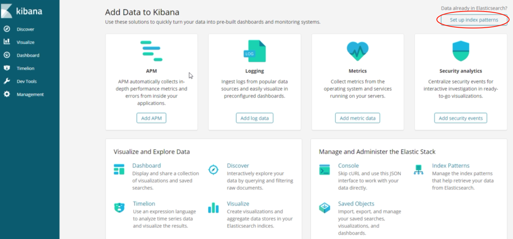
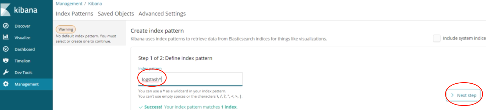
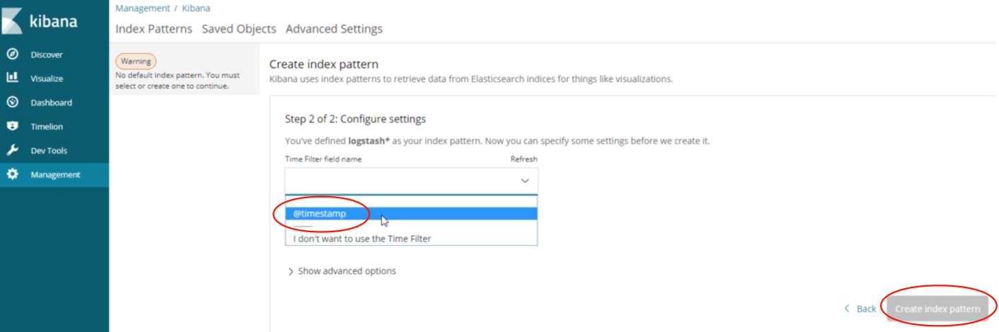
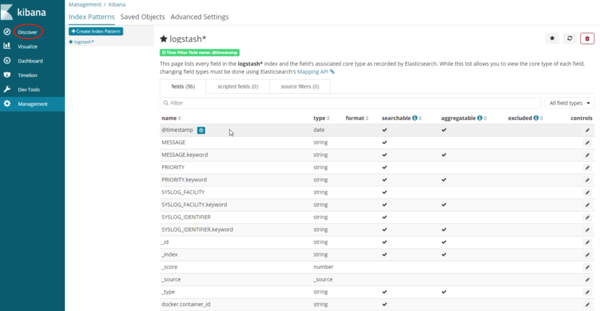
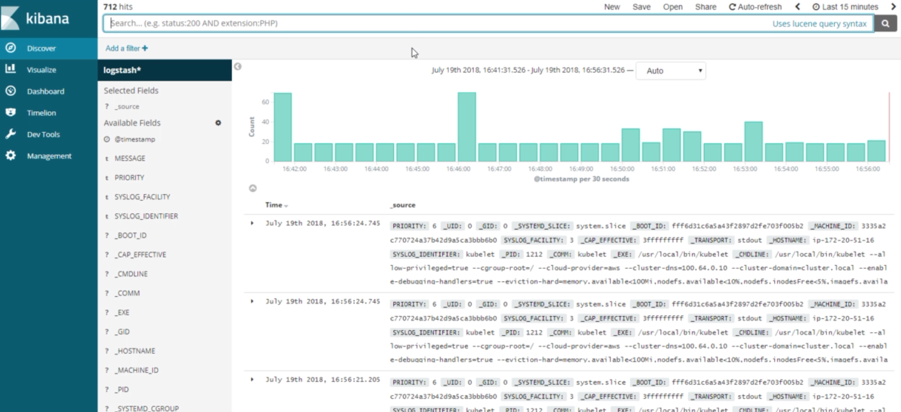

# Kibana

Even though we are using **fluentd** there is an index automatically generated that begins with **logstash** and today's date as a suffix (so we'd get a new index tomorrow with tomorrow's date).

Fluentd with automatically add a timestamp for each log:

---

​

Click on **Discover** to access the *Kibana search engine* and we'll initially see *all logs*:

