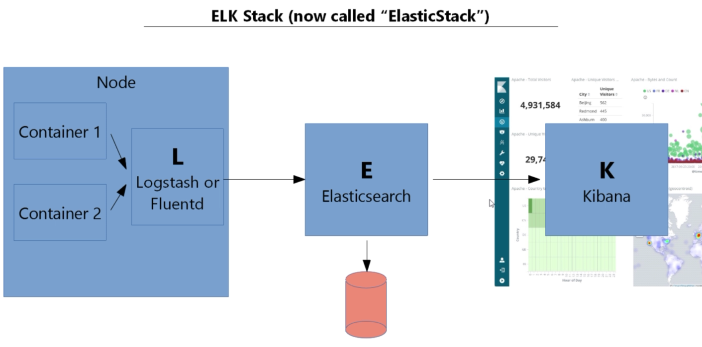
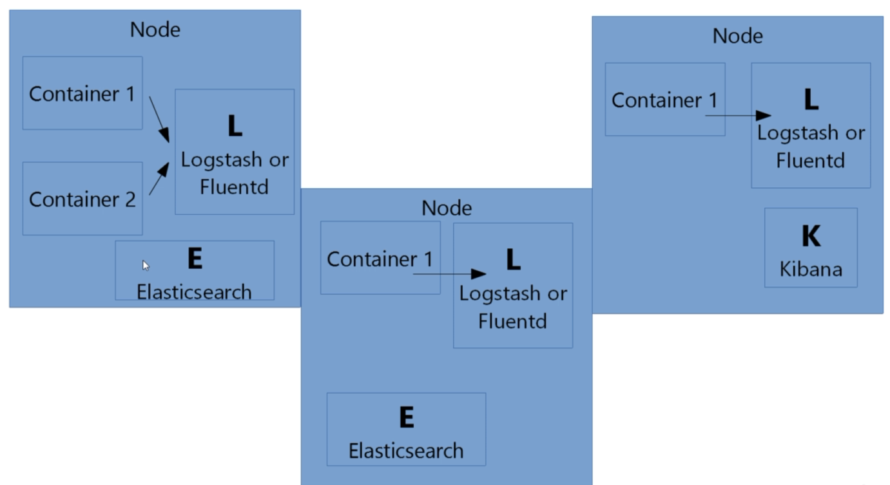

# Logging



- Logstash and Fluentd merely gather logs from containers or really anything such as a JVM instance.

- Elasticsearch stores data (such as logs) and said data can be queried. Think of it as a search engine implementation.

- Kibana lets you visualise your Elasticsearch data.



We can once again get things up and running with appropriate manifests, many of which are on [Github](https://github.com/kubernetes/kubernetes/tree/master/cluster/addons).

We have two manifests to deploy an elastic stack:

```bash
$ kubectl apply -f fluentd-config.yml
configmap "fluentd-es-config-v0.1.4" created
```

```bash
$ kubectl apply -f elastic-stack.yml
serviceaccount "fluentd-es" created
clusterrole "fluentd-es" created
clusterrolebinding "fluentd-es" created
daemonset "fluentd-es-v2.2.0" created
service "elasticsearch-logging" created
serviceaccount "elasticsearch-logging" created
clusterrole "elasticsearch-logging" created
clusterrolebinding "elasticsearch-logging" created
statefulset "elasticsearch-logging" created
deployment "kibana-logging" created
service "kibana-logging" created
```

```bash
$ kubectl get pods --namespace kube-system
NAME                                                             		READY     STATUS
dns-controller-547884bc7f-fbrbf                                  		1/1       Running
elasticsearch-logging-0                                          		1/1       Running
elasticsearch-logging-1                                             1/1       Running
etcd-server-events-ip-172-20-52-178.eu-west-2.compute.internal   		1/1       Running
etcd-server-ip-172-20-52-178.eu-west-2.compute.internal          		1/1       Running
fluentd-es-v2.2.0-dzxcb                                             1/1       Running
fluentd-es-v2.2.0-tk9vg                                             1/1       Running
fluentd-es-v2.2.0-zdd28                                             1/1       Running
kibana-logging-7444956bf8-m2jp6                                     1/1       Running
kube-apiserver-ip-172-20-52-178.eu-west-2.compute.internal          1/1       Running
kube-controller-manager-ip-172-20-52-178.eu-west-2.compute.internal 1/1       Running
kube-dns-6b4f4b544c-8hh8k                                           3/3       Running
kube-dns-6b4f4b544c-bvx8t                                           3/3       Running
kube-dns-autoscaler-6b658bd4d5-47bvd                                1/1       Running
kube-proxy-ip-172-20-111-161.eu-west-2.compute.internal             1/1       Running
kube-proxy-ip-172-20-36-108.eu-west-2.compute.internal              1/1       Running
kube-proxy-ip-172-20-52-178.eu-west-2.compute.internal              1/1       Running
kube-proxy-ip-172-20-81-112.eu-west-2.compute.internal              1/1       Running
kube-scheduler-ip-172-20-52-178.eu-west-2.compute.internal          1/1       Running
```

```bash
$ kubectl get services --namespace kube-system
NAME                    TYPE           CLUSTER-IP       EXTERNAL-IP        PORT(S)
elasticsearch-logging   ClusterIP      100.64.205.230   <none>             9200/TCP
kibana-logging          LoadBalancer   100.65.208.243   a34d4439c558d...   5601:30410/TCP
kube-dns                ClusterIP      100.64.0.10      <none>             53/UDP,53/TCP
```

```bash
$ kubectl describe service kibana-logging --namespace kube-system
Name:                     kibana-logging
Namespace:                kube-system
Labels:                   addonmanager.kubernetes.io/mode=Reconcile
                          k8s-app=kibana-logging
                          kubernetes.io/cluster-service=true
                          kubernetes.io/name=Kibana
Annotations:              kubectl.kubernetes.io/last-applied-configuration={"apiVersion":"v1","kind":"Service","metadata":{"annotations":{},"labels":{"addonmanager.kubernetes.io/mode":"Reconcile","k8s-app":"kibana-logging","ku...
Selector:                 k8s-app=kibana-logging
Type:                     LoadBalancer
IP:                       100.65.208.243
LoadBalancer Ingress:     a34d4439c558d11e9b1e4066dc42996f-529466565.eu-west-2.elb.amazonaws.com
Port:                     <unset>  5601/TCP
TargetPort:               ui/TCP
NodePort:                 <unset>  30410/TCP
Endpoints:
Session Affinity:         None
External Traffic Policy:  Cluster
Events:
  Type    Reason                Age   From                Message
  ----    ------                ----  ----                -------
  Normal  EnsuringLoadBalancer  10m   service-controller  Ensuring load balancer
  Normal  EnsuredLoadBalancer   10m   service-controller  Ensured load balancer
```

