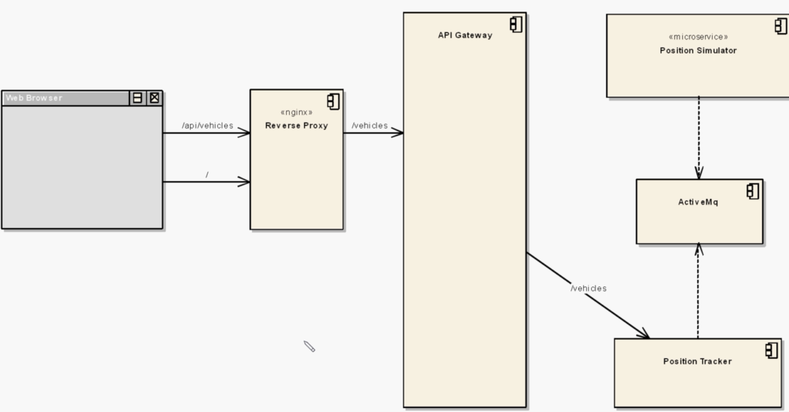
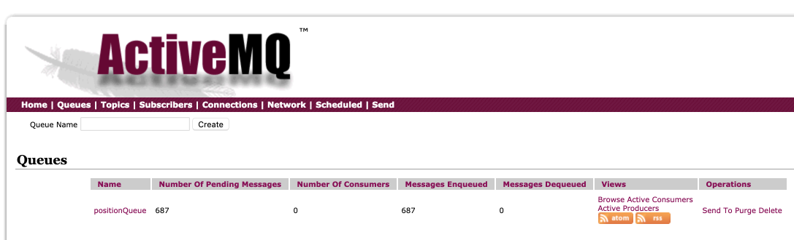
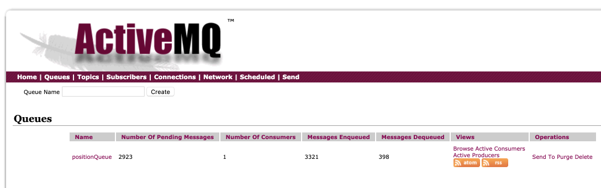

# Microservices



- Position Simulator

  Simulate vehicles moving around the country which, via GPS, periodically issue an event of the vehicle's location.

- API Gateway

  A standard to avoid, in this case, an Angular/JavaScript frontend to be calling each backend Microservice. So the API Gateway delegates calls to the appropriate backend services that are all small and often changing and being redeployed.

## Deploy

```bash
$ minikube start
```

Let's start afresh:

```bash
$ kubectl get all

NAME                         READY     STATUS    RESTARTS   AGE
po/mysql                     1/1       Running   1          13d
po/queue                     1/1       Running   2          15d
po/webapp-69cd68d8d7-kqf2q   1/1       Running   1          13d
...

$ kubectl delete -f .
pod "mysql" deleted
service "database" deleted
pod "queue" deleted
service "fleetman-queue" deleted
deployment "webapp" deleted
service "fleetman-webapp" deleted
```

**First, the queue:**

```bash
$ kubectl apply -f queue-deployment.yml
deployment "queue" created

$ kubectl apply -f queue-service.yml
service "fleetman-queue" created
```

```bash
$ kubectl get all
NAME           DESIRED   CURRENT   UP-TO-DATE   AVAILABLE   AGE
deploy/queue   1         1         1            1           48s

NAME                 DESIRED   CURRENT   READY     AGE
rs/queue-87f85649c   1         1         1         48s

NAME                       READY     STATUS    RESTARTS   AGE
po/queue-87f85649c-fjllq   1/1       Running   0          48s

NAME                TYPE       CLUSTER-IP    EXTERNAL-IP  PORT(S)                          
svc/fleetman-queue  NodePort   10.111.114.2  <none>       8161:30010/TCP,61616:31004/TCP   
svc/kubernetes      ClusterIP  10.96.0.1     <none>       443/TCP                          
```

```bash
$ minikube ip
192.168.99.119
```

and visit in your browser [http://192.168.99.119:30010](http://192.168.99.119:30010). Click the **Manage ActiveMQ broker** with **admin/admin**. The link to **Queues** will eventually show data.

**Then the Position Simulator**:

```bash
$ kubectl apply -f position-simulator-deployment.yml
deployment "position-simulator" created
```

And we could **follow** the pods logs:

```bash
$ kubectl logs -f po/position-simulator-dd6fb5b58-g7gjn
```

And we should see messages:



**And Then the Position Tracker**:

```bash
$ kubectl apply -f position-tracker-deployment.yml
deployment "position-tracker" created

$ kubectl apply -f position-tracker-service.yml
service "fleetman-position-tracker" created
```

And we'll see:



```bash
$ http http://192.168.99.119:30020/vehicles/City%20Truck
HTTP/1.1 200
Content-Type: application/json;charset=UTF-8
Date: Wed, 20 Mar 2019 22:26:37 GMT
Transfer-Encoding: chunked

{
    "lat": 53.37233807891607,
    "longitude": -1.485841115936637,
    "name": "City Truck",
    "speed": 0.7703012847622401,
    "timestamp": "2019-03-20T22:25:50.891+0000"
}
```

**And now the API Gateway**:

```bash
$ kubectl apply -f api-gateway-deployment.yml

$ kubectl apply -f api-gateway-service.yml
```

```bash
$ http 192.168.99.119:30020
HTTP/1.1 200
Content-Length: 59
Content-Type: text/plain;charset=UTF-8
Date: Wed, 20 Mar 2019 23:29:39 GMT

<p>Fleetman API Gateway at Wed Mar 20 23:29:39 GMT 2019</p>
```

**Finally the Web App**:

```bash
$ kubectl apply -f web-deployment.yml

$ kubectl apply -f web-service.yml
```

