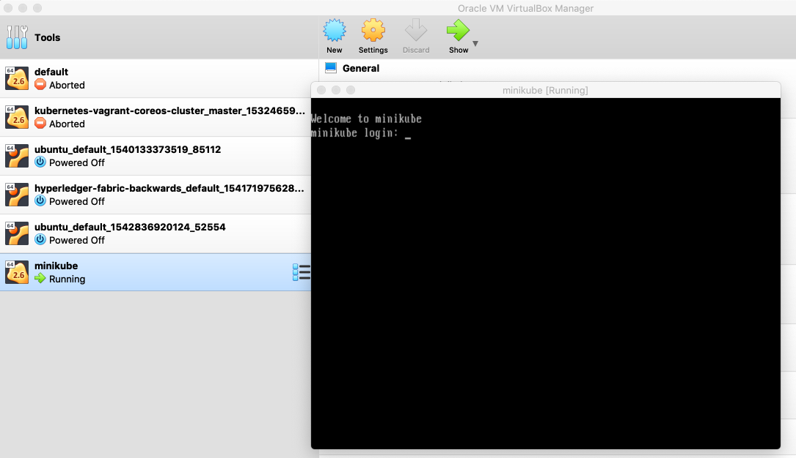
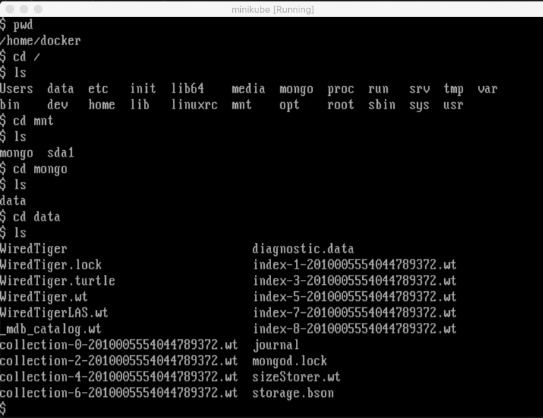

# Minikube

## Configuration

Bump the VM's memory, such as Virtualbox from 2GB to 3.5GB, and probably bump the video memory as well:

## Console

Double click **minikube** and login with user/password of **docker/tcuser**:

Within the console we could e.g. see a Mongo mounted volume, which is explored in [Persistence](persistence.md):

