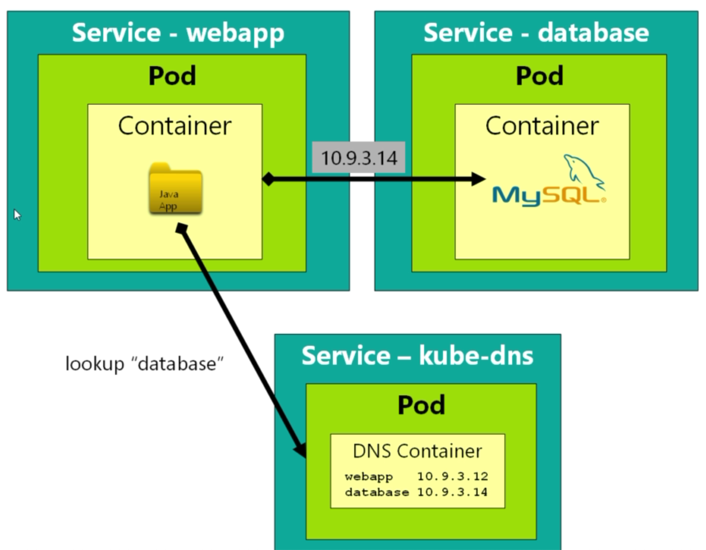

# Networking & Service Discovery

How do we network containers together?

If two containers are deployed into the same pod, then they can see each other as **localhost**.

> 

Nice and simple, but not recommended. Instead, let's go for:

> 

Kubernetes dynamically allocates an IP to each service which are held in essentially a key/value table, so we only need the key i.e. name of service.

The following won't show the **kube-dns** service:

```bash
$ kubectl get all
```

That's because of namespaces (the above showing us only what is in **default** namespace):

> 

```bash
$ kubectl get namespaces
NAME          STATUS    AGE
default       Active    6d
kube-public   Active    6d
kube-system   Active    6d
```

```bash
$ kubectl get all --namespace kube-system
NAME            DESIRED   CURRENT   READY     UP-TO-DATE   AVAILABLE   NODE SELECTOR   AGE
ds/kube-proxy   1         1         1         1            1           <none>          6d

NAME                              DESIRED   CURRENT   UP-TO-DATE   AVAILABLE   AGE
deploy/coredns                    2         2         2            2           6d
deploy/default-http-backend       1         1         1            1           6d
deploy/kubernetes-dashboard       1         1         1            1           6d
deploy/metrics-server             1         1         1            1           6d
deploy/nginx-ingress-controller   1         1         1            1           6d

NAME                                    DESIRED   CURRENT   READY     AGE
rs/coredns-86c58d9df4                   2         2         2         6d
rs/default-http-backend-5ff9d456ff      1         1         1         6d
rs/kubernetes-dashboard-ccc79bfc9       1         1         1         6d
rs/metrics-server-6fc4b7bcff            1         1         1         6d
rs/nginx-ingress-controller-7c66d668b   1         1         1         6d

NAME                                          READY     STATUS    RESTARTS   AGE
po/coredns-86c58d9df4-588bh                   1/1       Running   5          6d
po/coredns-86c58d9df4-8s2mx                   1/1       Running   3          6d
po/default-http-backend-5ff9d456ff-sdd5d      1/1       Running   3          6d
po/etcd-minikube                              1/1       Running   3          6d
po/kube-addon-manager-minikube                1/1       Running   3          6d
po/kube-apiserver-minikube                    1/1       Running   7          6d
po/kube-controller-manager-minikube           1/1       Running   3          3d
po/kube-proxy-zsfkc                           1/1       Running   0          22m
po/kube-scheduler-minikube                    1/1       Running   11         6d
po/kubernetes-dashboard-ccc79bfc9-4g7dn       1/1       Running   7          6d
po/metrics-server-6fc4b7bcff-gcsv7            1/1       Running   7          6d
po/nginx-ingress-controller-7c66d668b-h79ql   1/1       Running   16         6d
po/storage-provisioner                        1/1       Running   7          6d

NAME                       TYPE        CLUSTER-IP     EXTERNAL-IP   PORT(S)         AGE
svc/default-http-backend   NodePort    10.98.32.103   <none>        80:30001/TCP    6d
svc/kube-dns               ClusterIP   10.96.0.10     <none>        53/UDP,53/TCP   6d
svc/kubernetes-dashboard   ClusterIP   10.99.73.45    <none>        80/TCP          6d
svc/metrics-server         ClusterIP   10.105.85.89   <none>        443/TCP         6d
```

Back to *connecting containers* - there is the following declared in **networking-test.yml**:

```yaml
apiVersion: v1
kind: Pod
metadata:
  name: mysql
  labels:
    app: mysql
spec:
  containers:
    - name: mysql
      image: mysql:5
      env:
        # Use secret in real life
        - name: MYSQL_ROOT_PASSWORD
          value: password
        - name: MYSQL_DATABASE
          value: fleetman
---
apiVersion: v1
kind: Service
metadata:
  name: database
spec:
  type: ClusterIP
  selector:
    app: mysql
  ports:
    - port: 3306
```

and apply:

```bash
$ kubectl apply -f .
pod "mysql" created
service "database" created
pod "queue" unchanged
service "fleetman-queue" unchanged
deployment "webapp" configured
service "fleetman-webapp" unchanged
```

Let's jump onto the **webapp** pod where we should be able to access the **mysql** pod:

```bash
$ kubectl get all
NAME            DESIRED   CURRENT   UP-TO-DATE   AVAILABLE   AGE
deploy/webapp   2         2         2            2           1d

NAME                   DESIRED   CURRENT   READY     AGE
rs/webapp-69cd68d8d7   2         2         2         1d
rs/webapp-76997d5d65   0         0         0         1d

NAME                         READY     STATUS    RESTARTS   AGE
po/mysql                     1/1       Running   0          3m
po/queue                     1/1       Running   1          1d
po/webapp-69cd68d8d7-kqf2q   1/1       Running   0          3m
po/webapp-69cd68d8d7-ssbtg   1/1       Running   0          3m

NAME                  TYPE        CLUSTER-IP       EXTERNAL-IP   PORT(S)          AGE
svc/database          ClusterIP   10.106.27.49     <none>        3306/TCP         3m
svc/fleetman-queue    NodePort    10.101.170.198   <none>        8161:30010/TCP   1d
svc/fleetman-webapp   NodePort    10.106.155.128   <none>        8081:30080/TCP   1d
svc/kubernetes        ClusterIP   10.96.0.1        <none>        443/TCP          6d
```

Note - The file **resolv.conf** (on the container file system) configures how DNS resolution works.

```bash
$ kubectl exec -it webapp-69cd68d8d7-kqf2q sh
/ # cat /etc/resolv.conf
nameserver 10.96.0.10
search default.svc.cluster.local svc.cluster.local cluster.local
options ndots:5
```

Whenvever we make a reference to a **domain name**, the DNS server to use is at **10.96.0.10** which is the IP of the **kube-dns** service:

```bash
svc/kube-dns               ClusterIP   10.96.0.10     <none>        53/UDP,53/TCP
```

Let's do a **nslookup** of our **database**, and for illustration purposes, also Google:

```bash
/ # nslookup google.com
nslookup: can't resolve '(null)': Name does not resolve

Name:      google.com
Address 1: 216.239.38.120 any-in-2678.1e100.net

/ # nslookup database
nslookup: can't resolve '(null)': Name does not resolve

Name:      database
Address 1: 10.106.27.49 database.default.svc.cluster.local
```

The given IP for the database should match the Kubernetes service:

```bash
svc/database          ClusterIP   10.106.27.49     <none>        3306/TCP
```

Now let's install a mysql client to test:

```bash
/ # apk update

/ # apk add mysql-client
```

```bash
/ # mysql -h database -u root -p password fleetman
Welcome to the MariaDB monitor.  Commands end with ; or \g.
Your MySQL connection id is 2
Server version: 5.7.25 MySQL Community Server (GPL)

Copyright (c) 2000, 2018, Oracle, MariaDB Corporation Ab and others.

Type 'help;' or '\h' for help. Type '\c' to clear the current input statement.

MySQL [fleetman]> create table test (test varchar(255));
Query OK, 0 rows affected (0.08 sec)

MySQL [fleetman]> show tables;
+--------------------+
| Tables_in_fleetman |
+--------------------+
| test               |
+--------------------+
```

## Fully Qualified Domain Name (FQDN)

```bash
/ # nslookup database
nslookup: can't resolve '(null)': Name does not resolve

Name:      database
Address 1: 10.106.27.49 database.default.svc.cluster.local
```

**database.default.svc.cluster.local** is the FQDN of **database**.

Remember the following:

```bash
/ # cat /etc/resolv.conf
nameserver 10.96.0.10
search default.svc.cluster.local svc.cluster.local cluster.local
options ndots:5
```

The second line states, if we do a **nslookup database** and **database** is not found, then try in order

- database.default.svc.cluster.local
- database.svc.cluster.local
- database.cluster.local

where **default** relates to the namespace the service resides. So if the service is in the **default** namespace, then it is fine to just:

```bash
/ # nslookup database
```

However, if our database was in another namespace, we would have to specify it e.g.

```bash
/ # nslookup database.mynamespace
```

