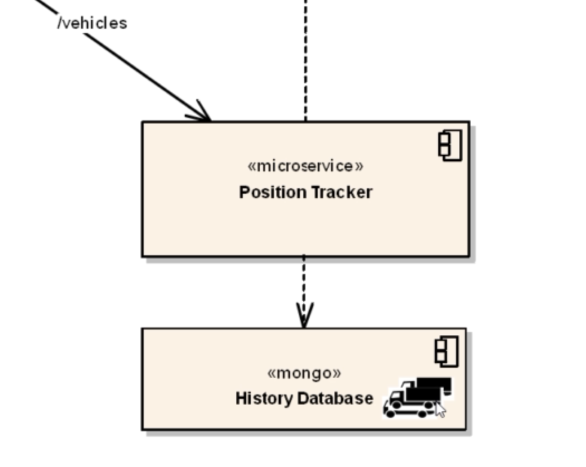

# Persistence

We'll use Mongo:



```bash
$ kubectl apply -f mongo-deployment.yml
```

When not completely configured, the **position tracker** microservice log shows:

```
com.mongodb.MongoSocketException: fleetman-mongodb.default.svc.cluster.local: Name or service not known
```

We need a service of mongo db named **fleetman-mongodb**:

```bash
$ kubectl apply -f mongo-service.yml
```

## Persistent Volume - Local

```yaml
apiVersion: apps/v1
kind: Deployment
metadata:
  name: mongo
spec:
  replicas: 1
  selector:
    matchLabels:
      app: mongo
  template: # Template for the pods
    metadata:
      labels:
        app: mongo
    spec:
      containers:
        - name: mongo
          image: mongo:3.6.5-jessie
          # Think of the following as only related to the container
          volumeMounts:
            - name: mongo-persistent-storage # Name of the Volume
              # Path to mount i.e. directory within the container to be mapped externally
              # (which folder, by default, does Mongo store its data)
              mountPath: /data/db
          # With the above, where do we actually store the data
          # (external to the container (and pod))?
          # We accomplish this with a "volume" (see below)
      volumes:
        - name: mongo-persistent-storage
          hostPath:
            path: /mnt/mongo/data
            type: DirectoryOrCreate
```

Above, we have effectively hardcoded the volume implementation i.e. the **hostPath** part. If we wish to do this in the cloud, such as AWS, we would have to replace this hostPath concept in a lot of Deployment manifests. And then what if we move from AWS to GCP? Again we would have to update a lot of manifests.

What if we can do something along the lines of:

```yaml
volumes:
	- name: mongo-persistent-storage
		# Pointer to the configuration of HOW we want the mount to be implemented
```

This concept is a **Persistent Volume Claim**.

## Persistent Volume Claim - Local

To apply this concept, we need a **PersistentVolumeClaim** manifest which declares **what do we want** in terms of resources etc. and we need a **PersistentVolume** manifest which declares **how do we want the storage implemented** such as **hostPath** for **local** storage, or will we be storing on AWS or GCP etc.

```yaml
# What do we want?
apiVersion: v1
kind: PersistentVolumeClaim
metadata:
	name: mongo-pvc
spec:
	accessModes:
    - ReadWriteOnce
	resources:
		requests:
			storage: 20Gi
```

```yaml
# How do we want it to be implemented
apiVersion: v1
kind: PersistentVolume
metadata:
	name: local-storage
spec:
  accessModes:
    - ReadWriteOnce
  capacity:
    storage: 20Gi    
	hostPath:
  	path: /mnt/mongo/data
    type: DirectoryOrCreate
```

Where we have to link the above two manifests via a **Storage Class**.

```bash
$ kubectl apply -f storage.yml
persistentvolumeclaim "mongo-pvc" created
persistentvolume "local-storage" created
```

```bash
$ kubectl get pv
NAME          CAPACITY ACCESS MODES RECLAIM POLICY STATUS  CLAIM               STORAGECLASS
local-storage 20Gi     RWO          Retain         Bound   default/mongo-pvc my-local-storage 
```

```bash
$ kubectl get pvc
NAME        STATUS    VOLUME          CAPACITY   ACCESS MODES   STORAGECLASS       AGE
mongo-pvc   Bound     local-storage   20Gi       RWO            my-local-storage   5m
```

```bash
$ kubectl apply -f mongo-deployment.yml
deployment "mongo" configured
```

A new Mongo pod will be created (though as we are reusing the local path, we will have to delete the original deployment):

```bash
$ kubectl describe po/mongo-6cbd45f588-7cjqh
Containers:
  mongo:
    Container ID:   docker://c3ae8cf183d094a8cb53a20e47dca471d301397591bbc37d749233a7e86f7218
    Image:          mongo:3.6.5-jessie
    Image ID:       docker-pullable://mongo@sha256:3e00936a4fbd17003cfd33ca808f03ada736134774bfbc3069d3757905a4a326
    ...
    Mounts:
      /data/db from mongo-persistent-storage (rw)
      /var/run/secrets/kubernetes.io/serviceaccount from default-token-2mljn (ro)
...
Volumes:
  mongo-persistent-storage:
    Type:       PersistentVolumeClaim (a reference to a PersistentVolumeClaim in the same namespace)
    ClaimName:  mongo-pvc
...
```

