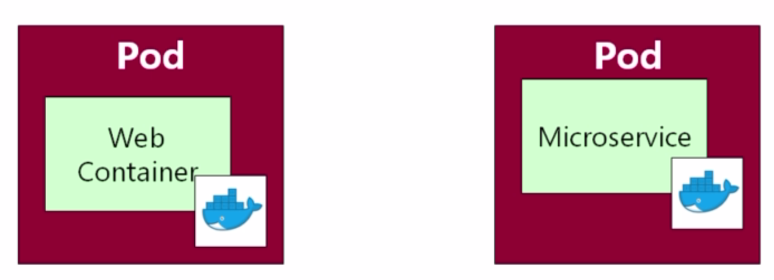
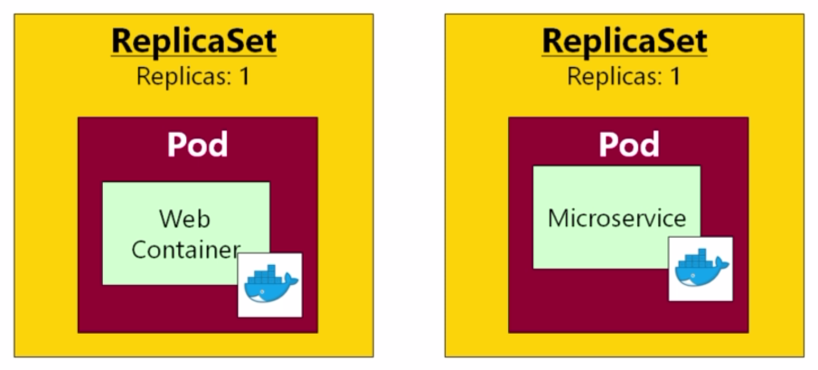
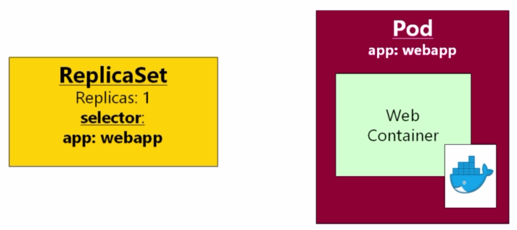

# ReplicaSets

Before we just had pod manifests giving:

> 

but moving onto ReplicaSets we can specify how many instances to keep running (unlike a pod manifest):

> 

Let's take our original pod manifest for the web app:

```yaml
apiVersion: v1
kind: Pod
metadata:
  name: webapp
  labels:
    app: webapp
    release: "0"
spec:
  containers:
    - name: webapp
      image: richardchesterwood/k8s-fleetman-webapp-angular:release0
      resources:
        limits:
          memory: 512Mi
          cpu: 250m
---
apiVersion: v1
kind: Pod
metadata:
  name: webapp-release-0-5
  labels:
    app: webapp
    release: "0-5"
spec:
  containers:
    - name: webapp
      image: richardchesterwood/k8s-fleetman-webapp-angular:release0-5
      resources:
        limits:
          memory: 512Mi
          cpu: 250m          
```

and only convert "release 0-5" into a replicaset:

```yaml
apiVersion: apps/v1
kind: ReplicaSet
metadata:
  name: webapp
spec:
  replicas: 1
  selector:
    matchLabels:
      app: webapp
  template: # template for the pods
    metadata:
      labels:
        app: webapp
    spec:
      containers:
        - name: webapp
          image: richardchesterwood/k8s-fleetman-webapp-angular:release0-5
          resources:
            limits:
              memory: 512Mi
              cpu: 250m
```

Take note of **selector** - this decides which pod definition should be part of the replicaset:

> 

Finally deploy:

```bash
$ kubectl delete pods --all

$ kubectl apply -f .
pod "queue" created
service "fleetman-queue" created
replicaset "webapp" created
service "fleetman-webapp" created
```

```bash
$ kubectl get all
NAME        DESIRED   CURRENT   READY     AGE
rs/webapp   1         1         1         21m

NAME              READY     STATUS    RESTARTS   AGE
po/queue          1/1       Running   0          21m
po/webapp-m24f4   1/1       Running   0          21m

NAME                  TYPE        CLUSTER-IP       EXTERNAL-IP   PORT(S)          AGE
svc/fleetman-queue    NodePort    10.101.118.156   <none>        8161:30010/TCP   21m
svc/fleetman-webapp   NodePort    10.107.169.44    <none>        8081:30080/TCP   21m
svc/kubernetes        ClusterIP   10.96.0.1        <none>        443/TCP          2d
```

```bash
$ kubectl describe replicaset webapp
Name:         webapp
Namespace:    default
Selector:     app=webapp
Labels:       app=webapp
Annotations:  kubectl.kubernetes.io/last-applied-configuration={"apiVersion":"apps/v1","kind":"ReplicaSet","metadata":{"annotations":{},"name":"webapp","namespace":"default"},"spec":{"replicas":1,"selector":{"match...
Replicas:     1 current / 1 desired
Pods Status:  1 Running / 0 Waiting / 0 Succeeded / 0 Failed
Pod Template:
  Labels:  app=webapp
  Containers:
   webapp:
    Image:  richardchesterwood/k8s-fleetman-webapp-angular:release0-5
    Port:   <none>
    Limits:
      cpu:        250m
      memory:     512Mi
    Environment:  <none>
    Mounts:       <none>
  Volumes:        <none>
Events:
  Type    Reason            Age   From                   Message
  ----    ------            ----  ----                   -------
  Normal  SuccessfulCreate  24m   replicaset-controller  Created pod: webapp-m24f4
```

Now if our pod goes down, Kubernetes will automatically start another:

```bash
$ kubectl delete pod webapp-m24f4
pod "webapp-m24f4" deleted

$ kubectl get all
NAME        DESIRED   CURRENT   READY     AGE
rs/webapp   1         1         0         1h

NAME              READY     STATUS              RESTARTS   AGE
po/queue          1/1       Running             0          1h
po/webapp-m24f4   0/1       Terminating         0          1h
po/webapp-zr657   0/1       ContainerCreating   0          2s

NAME                  TYPE        CLUSTER-IP       EXTERNAL-IP   PORT(S)          AGE
svc/fleetman-queue    NodePort    10.101.118.156   <none>        8161:30010/TCP   1h
svc/fleetman-webapp   NodePort    10.107.169.44    <none>        8081:30080/TCP   1h
svc/kubernetes        ClusterIP   10.96.0.1        <none>        443/TCP          2d
```

