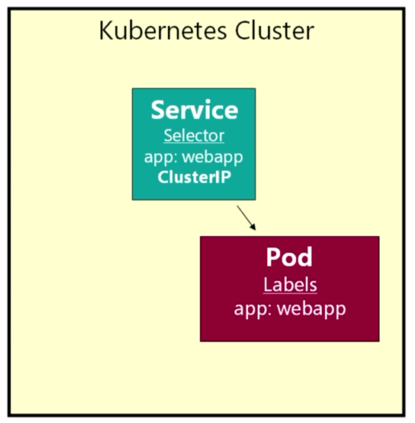

# Services

A service has an IP address and a stable fixed port - which essentially exposes applications in a cluster.

> 

Note that if we restart Minikube our [pod](pods.md) is restarted:

```bash
$ kubectl get all
NAME        READY     STATUS    RESTARTS   AGE
po/webapp   1/1       Running   1          3h

NAME             TYPE        CLUSTER-IP   EXTERNAL-IP   PORT(S)   AGE
svc/kubernetes   ClusterIP   10.96.0.1    <none>        443/TCP   36d
```

## Service Type

We choose from:

- LoadBalancer - Minikube cannot use this option.
- ClusterIP - Service is only accessible within cluster i.e. not outside.
- NodePort - Allows us to add a **nodePort** under **ports** within the Service manifest.

> 

---

> 

## Deploy Everything

Within the [k8s](../k8s) directory:

```bash
$ kubectl apply -f .
pod "webapp" created
service "fleetman-webapp" created
```

Check the browser:

```bash
$ minikube ip
192.168.99.119
```

> 

So we've deployed version 0. Let's deploy version 0-5 with no downtime - this is a first attempt, as there are better ways. If we had gone in and just changed the version label in the deployment then said pod would be brought down and then brought back up with the new version. However, this would incur downtime. We are going to use a second label.

> 

With a new pod with the new version of 0-5, we can just change the relevant label in the service:

> 

To achieve this we can copy our pod's original manifest and copy below **—** then changing the version. e.g

Before:

```yaml
apiVersion: v1
kind: Pod
metadata:
  name: webapp
  labels:
    app: webapp
spec:
  containers:
    - name: webapp
      image: richardchesterwood/k8s-fleetman-webapp-angular:release0
      resources:
        limits:
          memory: 1Gi
          cpu: 250m
```

After:

```yaml
apiVersion: v1
kind: Pod
metadata:
  name: webapp
  labels:
    app: webapp
    release: "0"
spec:
  containers:
    - name: webapp
      image: richardchesterwood/k8s-fleetman-webapp-angular:release0
      resources:
        limits:
          memory: 512Mi
          cpu: 250m
---
apiVersion: v1
kind: Pod
metadata:
  name: webapp-release-0-5
  labels:
    app: webapp
    release: "0-5"
spec:
  containers:
    - name: webapp
      image: richardchesterwood/k8s-fleetman-webapp-angular:release0-5
      resources:
        limits:
          memory: 512Mi
          cpu: 250m          
```

Let's deploy:

```bash
$ kubectl apply -f .
pod "webapp" configured
pod "webapp-release-0-5" created
service "fleetman-webapp" configured

$ kubectl get all
NAME                    READY     STATUS    RESTARTS   AGE
po/webapp               1/1       Running   0          3m
po/webapp-release-0-5   1/1       Running   0          3m

NAME                  TYPE        CLUSTER-IP      EXTERNAL-IP   PORT(S)          AGE
svc/fleetman-webapp   NodePort    10.101.92.103   <none>        8081:30080/TCP   3m
svc/kubernetes        ClusterIP   10.96.0.1       <none>        443/TCP          49m
```

and bump the service to 0-5.

Before:

```yaml
apiVersion: v1
kind: Service
metadata:
  name: fleetman-webapp
spec:
  ports:
    - name: http
      nodePort: 30080
      port: 8081
      targetPort: 80
  selector:
    app: webapp
    release: "0"
  type: NodePort
```

After:

```yaml
apiVersion: v1
kind: Service
metadata:
  name: fleetman-webapp
spec:
  ports:
    - name: http
      nodePort: 30080
      port: 8081
      targetPort: 80
  selector:
    app: webapp
    release: "0-5"
  type: NodePort
```

Is the service pointing towards the correct pod with the required release after an apply?

```bash
$ kubectl describe service fleetman-webapp
Name:                     fleetman-webapp
Namespace:                default
Labels:                   <none>
Annotations:              kubectl.kubernetes.io/last-applied-configuration={"apiVersion":"v1","kind":"Service","metadata":{"annotations":{},"name":"fleetman-webapp","namespace":"default"},"spec":{"ports":[{"name":"http","nodeP...
Selector:                 app=webapp,release=0-5
Type:                     NodePort
IP:                       10.101.92.103
Port:                     http  8081/TCP
TargetPort:               80/TCP
NodePort:                 http  30080/TCP
Endpoints:                172.17.0.9:80
Session Affinity:         None
External Traffic Policy:  Cluster
Events:                   <none>
```

The browser will probably have the previous version cached, so we need to hard refresh:

> 

```bash
$ kubectl get all --show-labels
NAME                    READY     STATUS    RESTARTS   AGE       LABELS
po/webapp               1/1       Running   0          12m       app=webapp,release=0
po/webapp-release-0-5   1/1       Running   0          12m       app=webapp,release=0-5

NAME                  TYPE        CLUSTER-IP      EXTERNAL-IP   PORT(S)          AGE       LABELS
svc/fleetman-webapp   NodePort    10.101.92.103   <none>        8081:30080/TCP   12m       <none>
svc/kubernetes        ClusterIP   10.96.0.1       <none>        443/TCP          58m       component=apiserver,provider=kubernetes
```

