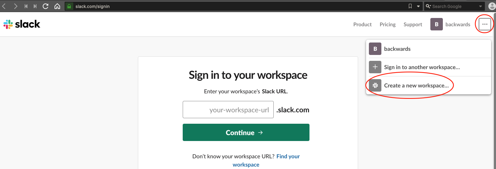
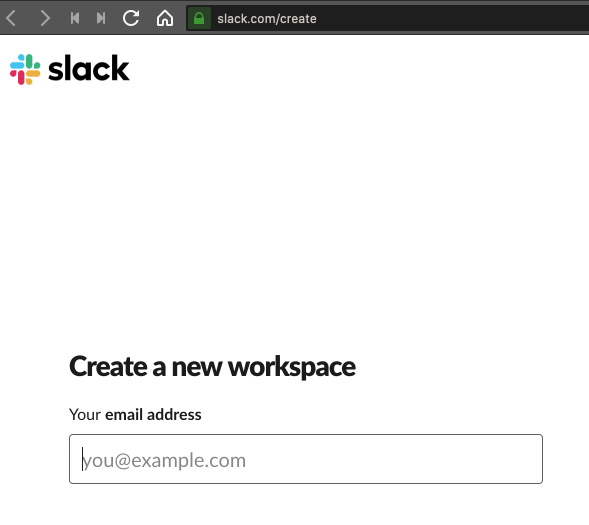
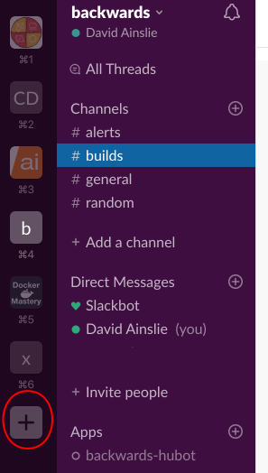
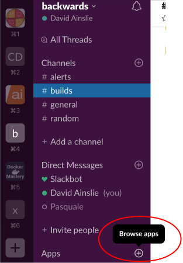
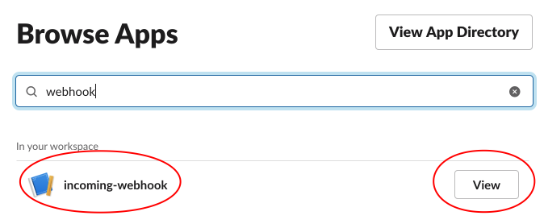

# Slack

If you don't already have a **workspace** then create one:



---



Or create a workspace from within the Slack App:



But I'm just going to reuse one.

Then create an **alerts** channel.

Add the **Incoming WebHooks** app (which you may already have installed):



---



Attach said app to the **alerts** channel and note the generated **webhook URL**. And we can test this URL:

```bash
$ http POST <webhook URL> channel=#alerts username=webhookbot text="Testing 1, 2, 3" icon_emoji=:ghost:
```

Let's create a manifest to configure alert manager to send alerts to our slack channel:

```yaml
global:
  slack_api_url: '<your slack webhook url>'

route:
  group_by: ['alertname']
  group_wait: 5s
  group_interval: 1m
  repeat_interval: 10m
  receiver: 'slack'

receivers:
  - name: 'slack'
    slack_configs:
      - channel: '#alerts'
        icon_emoji: ':bell:'
        send_resolved: true
        text: "<!channel> \nsummary: {{ .CommonAnnotations.message }}\n"
```

