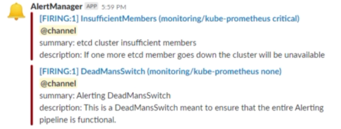

# Slack

If you don't already have a **workspace** then create one:


---


Or create a workspace from within the Slack App:


But I'm just going to reuse one.

Then create an **alerts** channel.

Add the **Incoming WebHooks** app (which you may already have installed):


---


Attach said app to the **alerts** channel and note the generated **webhook URL**. And we can test this URL:

```bash
$ http POST <webhook URL> channel=#alerts username=webhookbot text="Testing 1, 2, 3" icon_emoji=:ghost:
```

Let's create a manifest to configure alert manager to send alerts to our slack channel:

```yaml
global:
  slack_api_url: '<your slack webhook url>'

route:
  group_by: ['alertname']
  group_wait: 5s
  group_interval: 1m
  repeat_interval: 10m
  receiver: 'slack'

receivers:
  - name: 'slack'
    slack_configs:
      - channel: '#alerts'
        icon_emoji: ':bell:'
        send_resolved: true
        text: "<!channel> \nsummary: {{ .CommonAnnotations.message }}\n"
```

```bash
$ kubectl get pods --namespace monitoring
NAME                                                     READY     STATUS    RESTARTS   AGE
alertmanager-monitoring-prometheus-oper-alertmanager-0   0/2       Pending   0          4m
monitoring-grafana-6b5b9f466b-lbwfx                      2/2       Running   0          5m
monitoring-kube-state-metrics-57d54464b6-8cqdg           1/1       Running   0          5m
monitoring-prometheus-node-exporter-crwls                1/1       Running   0          5m
monitoring-prometheus-node-exporter-mwpn6                1/1       Running   0          5m
monitoring-prometheus-oper-operator-6fcb8bd65f-pj277     1/1       Running   0          5m
prometheus-monitoring-prometheus-oper-prometheus-0       0/3       Pending   0          4m

$ kubectl logs --namespace monitoring alertmanager-monitoring-prometheus-oper-alertmanager-0
Error from server (BadRequest): a container name must be specified for pod alertmanager-monitoring-prometheus-oper-alertmanager-0, choose one of: [alertmanager config-reloader]
```

What is this error?

The pod we want to view the logs has 2 containers, and we must specify which one. Use **-c** to stipulate which container:

```bash
$ kubectl logs --namespace monitoring alertmanager-monitoring-prometheus-oper-alertmanager-0 -c alertmanager
```

## Secrets

```bash
$ kubectl get secrets --namespace monitoring
NAME                                                  TYPE                               DATA
alertmanager-monitoring-prometheus-oper-alertmanager  Opaque                                1
default-token-k7g59                                   kubernetes.io/service-account-token   3
monitoring-grafana                                    Opaque                                3
monitoring-grafana-token-hjg9s                        kubernetes.io/service-account-token   3
monitoring-kube-state-metrics-token-k9blb             kubernetes.io/service-account-token   3
monitoring-prometheus-node-exporter-token-wjntp       kubernetes.io/service-account-token   3
monitoring-prometheus-oper-alertmanager-token-c9l5t   kubernetes.io/service-account-token   3
monitoring-prometheus-oper-operator-token-7s7g5       kubernetes.io/service-account-token   3
monitoring-prometheus-oper-prometheus-token-m8wjl     kubernetes.io/service-account-token   3
prometheus-monitoring-prometheus-oper-prometheus      Opaque                                1

$ kubectl get secret --namespace monitoring alertmanager-monitoring-prometheus-oper-alertmanager
NAME                                                   TYPE      DATA      AGE
alertmanager-monitoring-prometheus-oper-alertmanager   Opaque    1         22m
```

```bash
$ kubectl get secret --namespace monitoring alertmanager-monitoring-prometheus-oper-alertmanager -o json
{
    "apiVersion": "v1",
    "data": {
        "alertmanager.yaml": "Z2xvYmFsOgogIHJlc29sdmVfdGltZW91dDogNW0KcmVjZWl2ZXJzOgotIG5hbWU6ICJudWxsIgpyb3V0ZToKICBncm91cF9ieToKICAtIGpvYgogIGdyb3VwX2ludGVydmFsOiA1bQogIGdyb3VwX3dhaXQ6IDMwcwogIHJlY2VpdmVyOiAibnVsbCIKICByZXBlYXRfaW50ZXJ2YWw6IDEyaAogIHJvdXRlczoKICAtIG1hdGNoOgogICAgICBhbGVydG5hbWU6IFdhdGNoZG9nCiAgICByZWNlaXZlcjogIm51bGwiCg=="
    },
    "kind": "Secret",
    "metadata": {
        "creationTimestamp": "2019-04-13T10:32:10Z",
        "labels": {
            "app": "prometheus-operator-alertmanager",
            "chart": "prometheus-operator-5.0.11",
            "heritage": "Tiller",
            "release": "monitoring"
        },
        "name": "alertmanager-monitoring-prometheus-oper-alertmanager",
        "namespace": "monitoring",
        "resourceVersion": "1249",
        "selfLink": "/api/v1/namespaces/monitoring/secrets/alertmanager-monitoring-prometheus-oper-alertmanager",
        "uid": "64edfa67-5dd7-11e9-b331-0699f97e526c"
    },
    "type": "Opaque"
}
```

We essentially want to replace the "alertmanager.yml" i.e. the base64 value currently set. What is currently set? You can decode the above:

```bash
$ echo Z2xvYmFsOgogIHJlc29sdmVfdGltZW91dDogNW0KcmVjZWl2ZXJzOgotIG5hbWU6ICJudWxsIgpyb3V0ZToKICBncm91cF9ieToKICAtIGpvYgogIGdyb3VwX2ludGVydmFsOiA1bQogIGdyb3VwX3dhaXQ6IDMwcwogIHJlY2VpdmVyOiAibnVsbCIKICByZXBlYXRfaW50ZXJ2YWw6IDEyaAogIHJvdXRlczoKICAtIG1hdGNoOgogICAgICBhbGVydG5hbWU6IFdhdGNoZG9nCiAgICByZWNlaXZlcjogIm51bGwiCg== | base64 -d
global:
  resolve_timeout: 5m
receivers:
- name: "null"
route:
  group_by:
  - job
  group_interval: 5m
  group_wait: 30s
  receiver: "null"
  repeat_interval: 12h
  routes:
  - match:
      alertname: Watchdog
    receiver: "null"
```

First delete the current secret:

```bash
$ kubectl delete secret -n monitoring alertmanager-monitoring-prometheus-oper-alertmanager
secret "alertmanager-monitoring-prometheus-oper-alertmanager" deleted
```

And recreate using our *alert manager manifest*:

```bash
$ kubectl create secret -n monitoring generic alertmanager-monitoring-prometheus-oper-alertmanager --from-file=alertmanager.yaml

secret "alertmanager-monitoring-prometheus-oper-alertmanager" created
```

And you might now see alerts in Slack:

